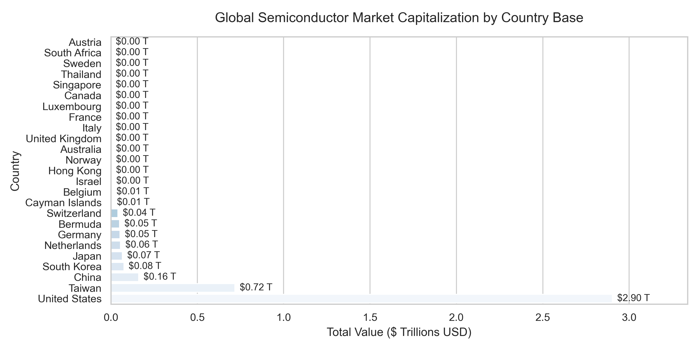

# Global-Semiconductor-Market-Capitalization-Share-Analysis
A programmatic financial analysis of 500+ global chip firms. By engineering text-cleaning pipelines to bypass geographic corporate suffix noise, the project quantifies macroeconomic market share concentration—revealing a stark valuation split between asset-light US design hubs and Taiwan's hyper-dense physical manufacturing ecosystem.

## Key Findings

### 1. The US "Mega-Cap Anchor" Phenomenon
While the United States accounts for only **66 companies** in the dataset, it commands over **4x the total market capitalization of Taiwan**. 
* **The Takeaway:** US semiconductor dominance is driven by an elite oligopoly of high-margin, asset-light **Fabless Design firms** (e.g., NVIDIA, Broadcom, AMD). By owning the software intellectual property rather than expensive physical cleanrooms, these players command exponentially higher market valuations per company.

### 2. Taiwan’s Deep Supply Chain Density
In stark contrast to the US, Taiwan hosts **165 listed corporations**, representing the densest ecosystem in the dataset. 
* **The Takeaway:** Beyond its crown jewel (TSMC), Taiwan operates as the physical engine of the global hardware market. Its long-tail ecosystem consists of hundreds of highly integrated, small-to-mid-cap suppliers handling precision wafer chemistry, assembly, and testing.

### 3. Extreme Power-Law Value Concentration
The global semiconductor value chain behaves as a strict geopolitical oligopoly rather than a distributed free market.
* **The Takeaway:** A tiny handful of mega-cap entities dictate roughly 70–80% of the entire industry's $5+ Trillion aggregate valuation. The rest of the hundreds of specialized niche engineering firms occupy a long, highly fragmented financial tail.

---

## Methodology & Pipeline Architectural Design
[Raw CSV Dataset] ➔ [Data Cleaning] ➔ [Macro Aggregations] ➔ [Charts & Insights]

1. **Ingestion & Environmental Setup:** Automated retrieval of global chip sector financial metrics using `kagglehub` and `pandas`.
2. **Macro Cross-Tabulation Analytics:** Segmented the cleaned ecosystem across global geographic boundaries, deriving total country value share, density counts, and dynamic average corporate valuations ($V_{avg} = \frac{\sum \text{Market Cap}}{\text{Company Count}}$).
4. **Data Visualization Assets:** Created visualizations using `matplotlib` and `seaborn` to contrast ecosystem density against financial scale.

---

## Core Visualizations
*Plots generated dynamically by the pipeline and saved directly to the workspace:*

1.  - Horizontal bar plot highlighting overall valuation concentration.
2. **`semiconductor_company_count_by_country.png`** - Distribution plot tracking organizational ecosystem density.
3.  - Financial share donut chart with a center-anchored aggregate industry market value overlay.

---

## Technologies Used
* **Language:** Python
* **Libraries:** Pandas, Matplotlib, Seaborn, Regex (`re`), Os, Kagglehub
* **Environment:** Jupyter Notebook / Anaconda
